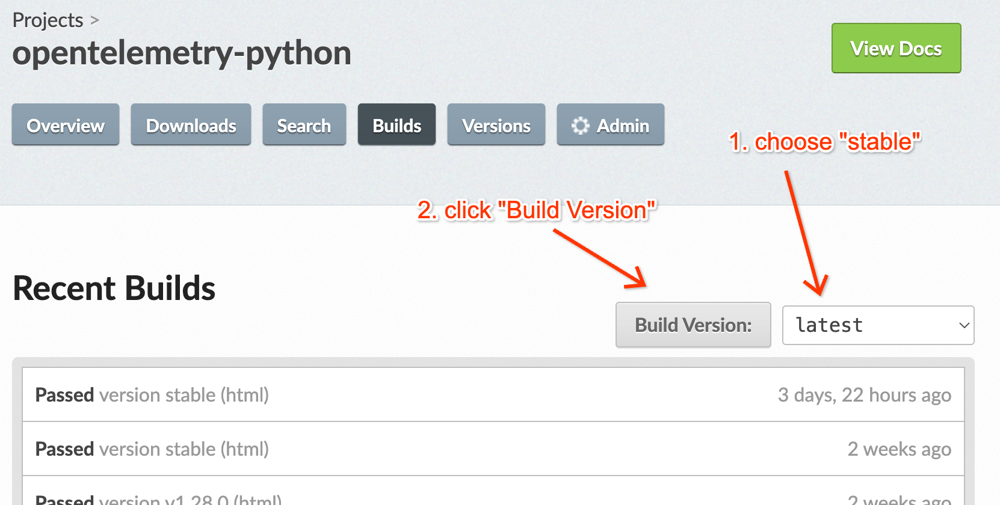

# Release instructions

## Preparing a new major or minor release

* Run the [Prepare release branch workflow](https://github.com/open-telemetry/opentelemetry-python/actions/workflows/prepare-release-branch.yml).
  * Press the "Run workflow" button, and leave the default branch `main` selected.
    * If making a pre-release of stable components (e.g. release candidate),
      enter the pre-release version number, e.g. `1.9.0rc2`.
      (otherwise the workflow will pick up the version from `main` and just remove the `.dev` suffix).
  * Review the two pull requests that it creates.
    (one is targeted to the release branch and one is targeted to `main`).
    * The builds will fail for the release PR because of validation rules. Follow the [release workflow](https://github.com/open-telemetry/opentelemetry-python-contrib/blob/main/RELEASING.md) for the contrib repo up until this same point.
    * Close and reopen the PR so that the workflow will take into account the label automation we have in place
    * Release builds now should pass.
  * Merge the release PR.
  * Merge the PR to main (this can be done separately from [making the release](#making-the-release))

## Preparing a new patch release

* Backport pull request(s) to the release branch.
  * Run the [Backport workflow](https://github.com/open-telemetry/opentelemetry-python/actions/workflows/backport.yml).
  * Press the "Run workflow" button, then select the release branch from the dropdown list,
    e.g. `release/v1.9.x`, then enter the pull request number that you want to backport,
    then click the "Run workflow" button below that.
  * Add the label `backport` to the generated pull request.
  * In case label automation doesn't work, just close and reopen the PR so that the workflow will take into account the label automation we have in place.
  * Review and merge the backport pull request that it generates.
* Merge a pull request to the release branch updating the `CHANGELOG.md`.
  * The heading for the unreleased entries should be `## Unreleased`.
* Run the [Prepare patch release workflow](https://github.com/open-telemetry/opentelemetry-python/actions/workflows/prepare-patch-release.yml).
  * Press the "Run workflow" button, then select the release branch from the dropdown list,
    e.g. `release/v1.9.x`, and click the "Run workflow" button below that.
  * Review and merge the pull request that it creates for updating the version.
* Note: If you are doing a patch release in `-core` repo, you should also do an equivalent patch release in `-contrib` repo (even if there's no fix to release), otherwise tests in CI will fail.

## Making the release

* Run the [Release workflow](https://github.com/open-telemetry/opentelemetry-python/actions/workflows/release.yml).
  * Press the "Run workflow" button, then select the release branch from the dropdown list,
    e.g. `release/v1.9.x`, and click the "Run workflow" button below that.
  * This workflow will publish the artifacts and publish a GitHub release with release notes based on the change log.
  * Verify that a new [Github release](https://github.com/open-telemetry/opentelemetry-python/releases) has been created and that the CHANGELOGs look correct.

## After the release

* Check PyPI
  * This should be handled automatically on release by the [publish action](https://github.com/open-telemetry/opentelemetry-python/blob/main/.github/workflows/release.yml).
  * Check the [action logs](https://github.com/open-telemetry/opentelemetry-python/actions?query=workflow%3APublish) to make sure packages have been uploaded to PyPI
  * Check the release history (e.g. https://pypi.org/project/opentelemetry-api/#history) on PyPI
  * If for some reason the action failed, see [Publish failed](#publish-failed) below
* Move stable tag and kick-off documentation build
  * Run the following (TODO automate):
    ```bash
    git tag -d stable
    git tag stable
    git push --delete origin stable
    git push origin tag stable
    ```
  * ReadTheDocs will not automatically rebuild on tag changes, so manually kick-off a build of stable:
    https://readthedocs.org/projects/opentelemetry-python/builds/.
    
  * This will ensure that ReadTheDocs for core are pointing at the stable release.

## Notes about version numbering for stable components

* The version number for stable components in the `main` branch is always `X.Y.0.dev`,
  where `X.Y.0` represents the next minor release.
* When the release branch is created, you can opt to make a "pre-release", e.g. `X.Y.0rc2`.
* If you ARE NOT making a "pre-release":
  * A "long-term" release branch will be created, e.g. `release/v1.9.x-0.21bx` (notice the wildcard x's).
    Later on, after the initial release, you can backport PRs to a "long-term" release branch and make patch releases
    from it.
  * The version number for stable components in the release branch will be bumped to remove the `.dev`,
    e.g. `X.Y.0`.
  * The version number for stable components in the `main` branch will be bumped to the next version,
    e.g. `X.{Y+1}.0.dev`.
* If you ARE making a "pre-release":
  * A "short-term" release branch will be created, e.g. `release/v1.9.0rc2-0.21b0` (notice the precise version with no
    wildcard x's). "Short-term" release branches do not support backports or patch releases after the initial release.
  * The version number for stable components in the `main` branch will not be bumped, e.g. it will remain `X.Y.0.dev`
    since the next minor release will still be `X.Y.0`.

## Notes about version numbering for unstable components

* The version number for unstable components in the `main` branch is always `0.Yb0.dev`,
  where `0.Yb0` represents the next minor release.
  * _Question: Is "b" (beta) redundant on "0." releases, or is this a python thing? I'm wondering if we can change it to `0.Y.0` to match up with the practice in js and go repos._
* Unstable components do not need "pre-releases", and so whether or not you are making a "pre-release" of stable
  components:
  * The version number for unstable components in the release branch will be bumped to remove the `.dev`,
    e.g. `0.Yb0`.
  * The version number for unstable components in the `main` branch will be bumped to the next version,
    e.g. `0.{Y+1}b0.dev`.

## Releasing dev version of new packages to claim namespace

When a contribution introduces a new package, in order to mitigate name-squatting incidents, release the current development version of the new package under the `opentelemetry` user to simply claim the namespace. This should be done shortly after the PR that introduced this package has been merged into `main`.

## Troubleshooting

### Publish failed

If for some reason the action failed, do it manually:

- Switch to the release branch (important so we don't publish packages with "dev" versions)
- Build distributions with `./scripts/build.sh`
- Delete distributions we don't want to push (e.g. `testutil`)
- Push to PyPI as `twine upload --skip-existing --verbose dist/*`
- Double check PyPI!
