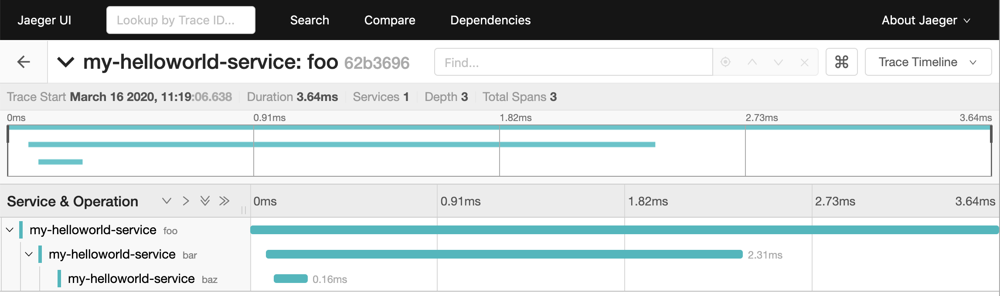

Getting Started with OpenTelemetry Python
=========================================

This guide will walk you through instrumenting a Python application with ``opentelemetry-python``.

For more elaborate examples, see `examples`.

Hello world: emitting a trace to your console
---------------------------------------------

To get started, install both the opentelemetry API and SDK:

.. code-block:: sh

    pip install opentelemetry-api
    pip install opentelemetry-sdk

The API package provides the interfaces required by the application owner, as well
as some helper logic to load implementations.

The SDK provides an implementation of those interfaces, designed to be generic and extensible enough
that in many situations, the SDK will be sufficient.

Once installed, we can now utilize the packages to emit spans from your application. A span
represents an action within your application that you want to instrument, such as an HTTP request
or a database call. Once instrumented, the application owner can extract helpful information such as
how long the action took, or add arbitrary attributes to the span that may provide more insight for debugging.

Here's an example of a script that emits a trace containing three named spans: "foo", "bar", and "baz":

.. code-block:: python

    # tracing.py
    from opentelemetry import trace
    from opentelemetry.sdk.trace import TracerProvider
    from opentelemetry.sdk.trace.export import ConsoleSpanExporter
    from opentelemetry.sdk.trace.export import SimpleExportSpanProcessor

    trace.set_tracer_provider(TracerProvider())
    trace.get_tracer_provider().add_span_processor(
        SimpleExportSpanProcessor(ConsoleSpanExporter())
    )
    tracer = trace.get_tracer(__name__)
    with tracer.start_as_current_span('foo'):
        with tracer.start_as_current_span('bar'):
            with tracer.start_as_current_span('baz'):
                print("Hello world from OpenTelemetry Python!")

We can run it, and see the traces print to your console:

.. code-block:: sh

    $ python tracing.py
    Hello world from OpenTelemetry Python!
    Span(name="baz",
         context=SpanContext(trace_id=0x37c1b154d9ab5a4b94b0046484b90400,
                             span_id=0xfacbb82a4d0cf5dd,
                             trace_state={}
         ),
         kind=SpanKind.INTERNAL,
         parent=Span(name="bar",
                     context=SpanContext(trace_id=0x37c1b154d9ab5a4b94b0046484b90400,
                                         span_id=0xb1894e8d588f5f62,
                                         trace_state={})
         ),
         start_time=2020-03-15T05:12:08.345394Z,
         end_time=2020-03-15T05:12:08.345450Z
     )
    Span(name="bar",
         context=SpanContext(trace_id=0x37c1b154d9ab5a4b94b0046484b90400,
                             span_id=0xb1894e8d588f5f62,
                             trace_state={}
         ),
         kind=SpanKind.INTERNAL,
         parent=Span(name="foo",
                     context=SpanContext(trace_id=0x37c1b154d9ab5a4b94b0046484b90400,
                                         span_id=0xde5ea23d6a9e4180,
                                         trace_state={})
         ),
         start_time=2020-03-15T05:12:08.345360Z,
         end_time=2020-03-15T05:12:08.345597Z
    )
    Span(name="foo",
         context=SpanContext(trace_id=0x37c1b154d9ab5a4b94b0046484b90400,
                             span_id=0xde5ea23d6a9e4180,
                             trace_state={}
         ),
         kind=SpanKind.INTERNAL,
         parent=None,
         start_time=2020-03-15T05:12:08.345287Z,
         end_time=2020-03-15T05:12:08.345673Z
    )

Each span typically represents a single operation or unit of work.
Spans can be nested, and have a parent-child relationship with other spans.
While a given span is active, newly-created spans will inherit the active span's trace ID, options, and other attributes of its context.
A span without a parent is called the "root span", and a trace is comprised of one root span and its descendants.

In the example above, the OpenTelemetry Python library creates one trace containing three spans and prints it to STDOUT.

Configure exporters to emit spans elsewhere
-------------------------------------------

The example above does emit information about all spans, but the output is a bit hard to read.
In common cases, you would instead *export* this data to an application performance monitoring backend, to be visualized and queried.
It is also common to aggregate span and trace information from multiple services into a single database, so that actions that require multiple services can still all be visualized together.

This concept is known as distributed tracing. One such distributed tracing backend is known as Jaeger.

The Jaeger project provides an all-in-one docker container that provides a UI, database, and consumer. Let's bring
it up now:

.. code-block:: sh

    docker run -p 16686:16686 -p 6831:6831/udp jaegertracing/all-in-one

This will start Jaeger on port 16686 locally, and expose Jaeger thrift agent on port 6831. You can visit it at http://localhost:16686.

With this backend up, your application will now need to export traces to this system. ``opentelemetry-sdk`` does not provide an exporter
for Jaeger, but you can install that as a separate package:

.. code-block:: sh

    pip install opentelemetry-ext-jaeger

Once installed, update your code to import the Jaeger exporter, and use that instead:

.. code-block:: python

    # jaeger-example.py
    from opentelemetry import trace
    from opentelemetry.ext import jaeger
    from opentelemetry.sdk.trace import TracerProvider
    from opentelemetry.sdk.trace.export import SimpleExportSpanProcessor

    trace.set_tracer_provider(TracerProvider())

    jaeger_exporter = jaeger.JaegerSpanExporter(
        service_name="my-helloworld-service", agent_host_name="localhost", agent_port=6831
    )

    trace.get_tracer_provider().add_span_processor(
        SimpleExportSpanProcessor(jaeger_exporter)
    )
    tracer = trace.get_tracer(__name__)
    with tracer.start_as_current_span('foo'):
        with tracer.start_as_current_span('bar'):
            with tracer.start_as_current_span('baz'):
                print("Hello world from OpenTelemetry Python!")

Run the script:

.. code-block:: python

    python jaeger-example.py

You can then visit the jaeger UI, see you service under "services", and find your traces!

Integrations example with Flask
-------------------------------

The above is a great example, but it's very manual. Within the telemetry space, there are common actions that one wants to instrument:

* HTTP responses from web services
* HTTP requests from clients
* Database calls

To help instrument common scenarios, opentelemetry also has the concept of "instrumentations": packages that are designed to interface
with a specific framework or library, such as Flask and psycopg2. A list of the currently curated extension packages can be found :scm_web:`here <ext/>`.

We will now instrument a basic Flask application that uses the requests library to send HTTP requests. First, install the instrumentation packages themselves:

.. code-block:: sh

    pip install opentelemetry-ext-flask
    pip install opentelemetry-ext-http-requests

And let's write a small Flask application that sends an HTTP request, activating each instrumentation during the initialization:

.. code-block:: python

    # flask_example.py
    from opentelemetry.ext.flask import FlaskInstrumentor
    FlaskInstrumentor().instrument()  # This needs to be executed before importing Flask

    import flask
    import requests

    import opentelemetry.ext.http_requests
    from opentelemetry import trace
    from opentelemetry.sdk.trace import TracerProvider
    from opentelemetry.sdk.trace.export import ConsoleSpanExporter
    from opentelemetry.sdk.trace.export import SimpleExportSpanProcessor

    trace.set_tracer_provider(TracerProvider())
    trace.get_tracer_provider().add_span_processor(
        SimpleExportSpanProcessor(ConsoleSpanExporter())
    )

    app = flask.Flask(__name__)
    opentelemetry.ext.http_requests.enable(trace.get_tracer_provider())

    @app.route("/")
    def hello():
        tracer = trace.get_tracer(__name__)
        with tracer.start_as_current_span("example-request"):
            requests.get("http://www.example.com")
        return "hello"

    app.run(debug=True, port=5000)

Now run the above script, hit the root url (http://localhost:5000/) a few times, and watch your spans be emitted!

.. code-block:: sh

   python flask_example.py

Adding Metrics
--------------

Spans are a great way to get detailed information about what your application is doing, but
what about a more aggregated perspective? OpenTelemetry provides supports for metrics, a time series
of numbers that might express things such as CPU utilization, request count for an HTTP server, or a
business metric such as transactions.

All metrics can be annotated with labels: additional qualifiers that help describe what
subdivision of the measurements the metric represents.

The following is an example of emitting metrics to console, in a similar fashion to the trace example:

.. code-block:: python

    # metrics.py
    import sys
    import time

    from opentelemetry import metrics
    from opentelemetry.sdk.metrics import Counter, MeterProvider
    from opentelemetry.sdk.metrics.export import ConsoleMetricsExporter
    from opentelemetry.sdk.metrics.export.controller import PushController

    metrics.set_meter_provider(MeterProvider())
    meter = metrics.get_meter(__name__, True)
    exporter = ConsoleMetricsExporter()
    controller = PushController(meter, exporter, 5)

    staging_labels = {"environment": "staging"}

    requests_counter = meter.create_metric(
        name="requests",
        description="number of requests",
        unit="1",
        value_type=int,
        metric_type=Counter,
        label_keys=("environment",),
    )

    requests_counter.add(25, staging_labels)
    time.sleep(5)

    requests_counter.add(20, staging_labels)
    time.sleep(5)

The sleeps will cause the script to take a while, but running it should yield:

.. code-block:: sh

    $ python metrics.py
    ConsoleMetricsExporter(data="Counter(name="requests", description="number of requests")", labels="(('environment', 'staging'),)", value=25)
    ConsoleMetricsExporter(data="Counter(name="requests", description="number of requests")", labels="(('environment', 'staging'),)", value=45)

Using Prometheus
----------------

Similar to traces, it is really valuable for metrics to have its own data store to help visualize and query the data. A common solution for this is
`Prometheus <https://prometheus.io/>`_.

Let's start by bringing up a Prometheus instance ourselves, to scrape our application. Write the following configuration:

.. code-block:: yaml

    # /tmp/prometheus.yml
    scrape_configs:
    - job_name: 'my-app'
      scrape_interval: 5s
      static_configs:
      - targets: ['localhost:8000']

And start a docker container for it:

.. code-block:: sh

    # --net=host will not work properly outside of Linux.
    docker run --net=host -v /tmp/prometheus.yml:/etc/prometheus/prometheus.yml prom/prometheus \
        --log.level=debug --config.file=/etc/prometheus/prometheus.yml

For our Python application, we will need to install an exporter specific to Prometheus:

.. code-block:: sh

    pip install opentelemetry-ext-prometheus

And use that instead of the `ConsoleMetricsExporter`:

.. code-block:: python

    # prometheus.py
    import sys
    import time

    from opentelemetry import metrics
    from opentelemetry.ext.prometheus import PrometheusMetricsExporter
    from opentelemetry.sdk.metrics import Counter, MeterProvider
    from opentelemetry.sdk.metrics.export import ConsoleMetricsExporter
    from opentelemetry.sdk.metrics.export.controller import PushController
    from prometheus_client import start_http_server

    # Start Prometheus client
    start_http_server(port=8000, addr="localhost")

    batcher_mode = "stateful"
    metrics.set_meter_provider(MeterProvider())
    meter = metrics.get_meter(__name__, batcher_mode == "stateful")
    exporter = PrometheusMetricsExporter("MyAppPrefix")
    controller = PushController(meter, exporter, 5)

    staging_labels = {"environment": "staging"}

    requests_counter = meter.create_metric(
        name="requests",
        description="number of requests",
        unit="1",
        value_type=int,
        metric_type=Counter,
        label_keys=("environment",),
    )

    requests_counter.add(25, staging_labels)
    time.sleep(5)

    requests_counter.add(20, staging_labels)
    time.sleep(5)

    # This line is added to keep the HTTP server up long enough to scrape.
    input("Press any key to exit...")

The Prometheus server will run locally on port 8000, and the instrumented code will make metrics available to Prometheus via the `PrometheusMetricsExporter`.
Visit the Prometheus UI (http://localhost:9090) to view your metrics.

Using the OpenTelemetry Collector for traces and metrics
--------------------------------------------------------

Although it's possible to directly export your telemetry data to specific backends, you may more complex use cases, including:

* having a single telemetry sink shared by multiple services, to reduce overhead of switching exporters
* aggregating metrics or traces across multiple services, running on multiple hosts

To enable a broad range of aggregation strategies, OpenTelemetry provides the `opentelemetry-collector <https://github.com/open-telemetry/opentelemetry-collector>`_.
The Collector is a flexible application that can consume trace and metric data and export to multiple other backends, including to another instance of the Collector.

To see how this works in practice, let's start the Collector locally. Write the following file:

.. code-block:: yaml

    # /tmp/otel-collector-config.yaml
    receivers:
        opencensus:
            endpoint: 0.0.0.0:55678
    exporters:
        logging:
            loglevel: debug
    processors:
        batch:
        queued_retry:
    service:
        pipelines:
            traces:
                receivers: [opencensus]
                exporters: [logging]
                processors: [batch, queued_retry]
            metrics:
                receivers: [opencensus]
                exporters: [logging]

Start the docker container:

.. code-block:: sh

    docker run -p 55678:55678 \
        -v /tmp/otel-collector-config.yaml:/etc/otel-collector-config.yaml \
        omnition/opentelemetry-collector-contrib:latest \
        --config=/etc/otel-collector-config.yaml

Install the OpenTelemetry Collector exporter:

.. code-block:: sh

    pip install opentelemetry-ext-otcollector

And execute the following script:

.. code-block:: python

    # otcollector.py
    import time
    from opentelemetry import trace
    from opentelemetry.ext.otcollector.trace_exporter import CollectorSpanExporter
    from opentelemetry.sdk.trace import TracerProvider
    from opentelemetry.sdk.trace.export import BatchExportSpanProcessor
    from opentelemetry import metrics
    from opentelemetry.ext.otcollector.metrics_exporter import CollectorMetricsExporter
    from opentelemetry.sdk.metrics import Counter, MeterProvider
    from opentelemetry.sdk.metrics.export.controller import PushController

    # create a CollectorSpanExporter
    span_exporter = CollectorSpanExporter(
        # optional:
        # endpoint="myCollectorUrl:55678",
        # service_name="test_service",
        # host_name="machine/container name",
    )
    tracer_provider = TracerProvider()
    trace.set_tracer_provider(tracer_provider)
    span_processor = BatchExportSpanProcessor(span_exporter)
    tracer_provider.add_span_processor(span_processor)

    # create a CollectorMetricsExporter
    metric_exporter = CollectorMetricsExporter(
        # optional:
        # endpoint="myCollectorUrl:55678",
        # service_name="test_service",
        # host_name="machine/container name",
    )

    # Meter is responsible for creating and recording metrics
    metrics.set_meter_provider(MeterProvider())
    meter = metrics.get_meter(__name__)
    # controller collects metrics created from meter and exports it via the
    # exporter every interval
    controller = PushController(meter, metric_exporter, 5)

    # Configure the tracer to use the collector exporter
    tracer = trace.get_tracer_provider().get_tracer(__name__)

    with tracer.start_as_current_span("foo"):
        print("Hello world!")

    requests_counter = meter.create_metric(
        name="requests",
        description="number of requests",
        unit="1",
        value_type=int,
        metric_type=Counter,
        label_keys=("environment",),
    )
    # Labels are used to identify key-values that are associated with a specific
    # metric that you want to record. These are useful for pre-aggregation and can
    # be used to store custom dimensions pertaining to a metric
    labels = {"environment": "staging"}
    requests_counter.add(25, labels)
    time.sleep(10)  # give push_controller time to push metrics
