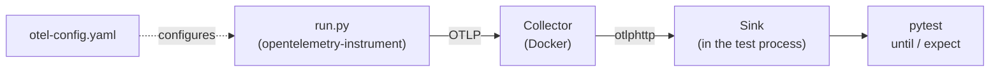

# Declarative configuration end-to-end tests

Each scenario runs an app under `opentelemetry-instrument`, configured only by
a declarative config file. The app exports to a real OpenTelemetry Collector,
which forwards everything to an OTLP receiver in the test process (the sink).



Run the suite with:

```sh
uv run tox -e docker-tests-declconfig
```

## Scenarios

Every directory under `scenarios/` is one test case:

| File                    | Purpose                                                                     |
| ----------------------- | --------------------------------------------------------------------------- |
| `scenario.yaml`         | Description, when to stop (`until`) and what to check (`expect`).           |
| `otel-config.yaml`      | The SDK config, passed as `OTEL_CONFIG_FILE`. Can be `otel-config.json`.    |
| `run.py`                | The app. Uses only the OpenTelemetry API.                                   |
| `collector-config.yaml` | Optional. Defaults to the shared [`collector-config.yaml`](collector-config.yaml). |

The shared collector receives OTLP on gRPC `4317` and HTTP `4318`. Configs
reach it at `<scheme>://${OTEL_COLLECTOR_ENDPOINT}:<port>`. A custom collector
config must enable `health_check` on `0.0.0.0:13133` and export with
`otlphttp` to `${env:OTLP_SINK_ENDPOINT}`.

The app doesn't inherit `OTEL_*` variables from the test environment.

## `scenario.yaml`

The full format is in [`scenario.schema.json`](scenario.schema.json).

```yaml
description: Exports a span over OTLP/HTTP.
timeout: 30                     # seconds, default 30
env: {MY_VAR: value}            # extra environment variables for the app
until:                          # all must hold
  - spans: {name: my-span, min_count: 1}
  - metric: {name: requests, field: value, min: 5}   # field: value | count | sum
  - logs: {body_pattern: "user .* in"}
  - exited: {}                  # the app exited cleanly
expect:
  - resource:                   # every received item must match
      schema_url: https://opentelemetry.io/schemas/1.26.0
      attributes: {values: {service.name: my-service}}
  - spans:
      name: my-span
      kind: INTERNAL
      parent: {name: outer}     # nested span matcher
      attributes: {values: {http.method: GET}, strict: true}
      count: 1                  # or min_count (default 1) / max_count
  - metric:
      name: requests
      type: sum
      temporality: CUMULATIVE
      data_point: {value: {gte: 3}, exemplar_count: {gte: 1}}
  - logs:
      body: {pattern: "user .* in"}
      severity_number: WARN
      span: {name: handler}
  - output:
      stream: stderr            # stdout | stderr
      pattern: Unsupported file_format
      exists: true              # false asserts no match
```

`count: 0` asserts that nothing matches. Pair it with `until: [exited: {}]`
when nothing should be exported at all.

Values are type strict: `5` matches only an int, `5.0` only a double and
`"5"` only a string. Use `{double: 5}` or `{kvlist: {...}}` to set a type
explicitly. Instead of a literal, a matcher can use the operators `pattern`,
`exists`, `gt`, `gte`, `lt` and `lte`.

A failure lists each unmet entry with its closest candidates, plus the app's
stdout and stderr.
